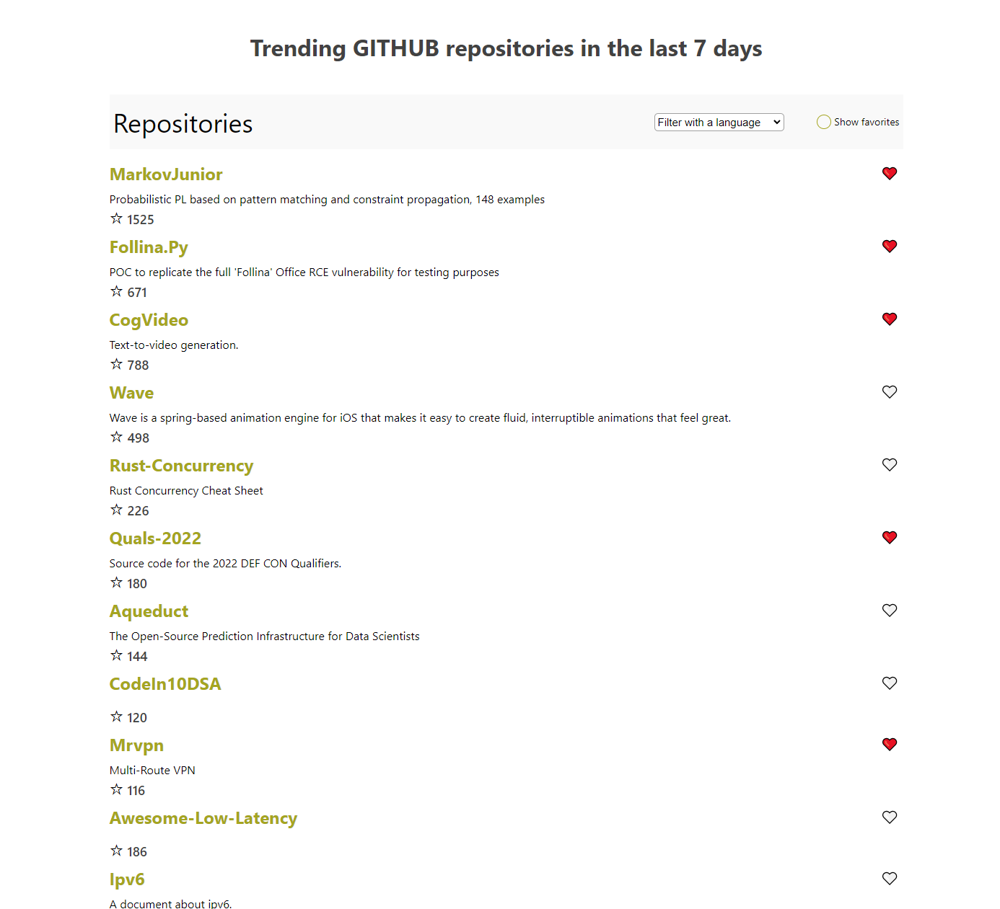

# GitHub Trending Repositories

This Project main idea is to fetch the most started github repositories on the last 7 days, I did work on this project based on some requirement by a company called Veed.io for a technical front end interview

# Preview



## Built With
ReactJS 18,
ReactDOM 18,
TypeScript,
Redux,
create-react-app,
styled-components,
redux-saga

## Live Demo
[Live Demo Link](https://github-trending-repositories.vercel.app/)

## Getting Started

### Prerequisites

In order to have this project up and running you will need:

- NodeJS 10+

### Setup

First, you need to clone this project using one of the links above, using this command:

```Javascript
git clone RESPOSITRY_LINK
```

Then you should run: `yarn`

And afterward, you supposed to run: `yarn start`, to run the project in your local machine.

Then head to the localhost on port 3000 `https://localhost:3000`

Congrats the project is fully working.

## Available Scripts

In the project directory, you can run:

### `yarn start`

Runs the app in the development mode.\
Open [http://localhost:3000](http://localhost:3000) to view it in the browser.

The page will reload if you make edits.\
You will also see any lint errors in the console.

### `yarn test`

Launches the test runner in the interactive watch mode.\
See the section about [running tests](https://facebook.github.io/create-react-app/docs/running-tests) for more information.

### `yarn run build`

Builds the app for production to the `build` folder.\
It correctly bundles React in production mode and optimizes the build for the best performance.

The build is minified and the filenames include the hashes.\
Your app is ready to be deployed!

See the section about [deployment](https://facebook.github.io/create-react-app/docs/deployment) for more information.

### `yarn run eject`

**Note: this is a one-way operation. Once you `eject`, you can’t go back!**

If you aren’t satisfied with the build tool and configuration choices, you can `eject` at any time. This command will remove the single build dependency from your project.

Instead, it will copy all the configuration files and the transitive dependencies (webpack, Babel, ESLint, etc) right into your project so you have full control over them. All of the commands except `eject` will still work, but they will point to the copied scripts so you can tweak them. At this point you’re on your own.

You don’t have to ever use `eject`. The curated feature set is suitable for small and middle deployments, and you shouldn’t feel obligated to use this feature. However we understand that this tool wouldn’t be useful if you couldn’t customize it when you are ready for it.

## Learn More

You can learn more in the [Create React App documentation](https://facebook.github.io/create-react-app/docs/getting-started).

To learn React, check out the [React documentation](https://reactjs.org/).
